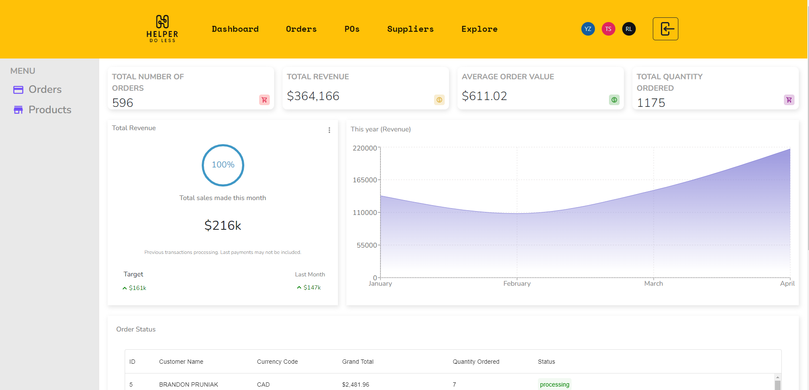
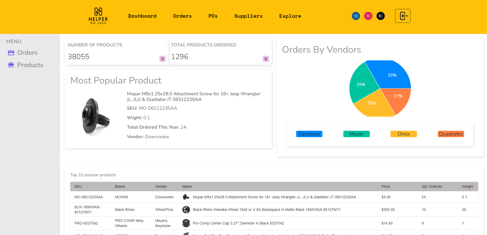
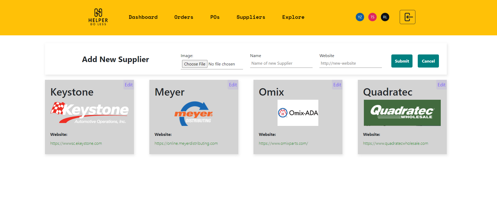
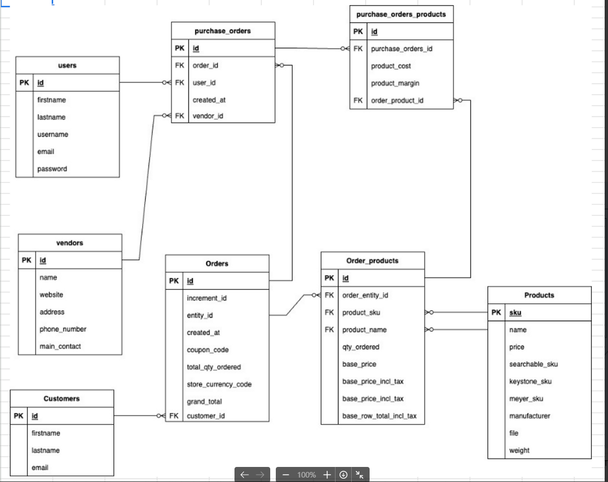

# Helper Do Less

## Project descriptions

This app streamlines the sales representatives' ordering process. It was inspired by a real business pain point where sales reps needed to manually check prices and place orders.

### Dashboard

### Order Table

### Order cancel

### Order Table PopUp Show Item information on suppliers' cost with ONLY one click

### Search and sort functions in each column

### Purchase order

### Suppliers page -- add a supplier, edit a supplier

### Explore sku autocomplete

### Explore brand, export to Excel

### Database ERD

## Tech Stacks

- React, React Router, Axios
- NodeJS, Prisma
- Postgres
- API, Ant Design, Material UI

## User Stories

- manager can check sale report of revenue, and qty, by vendor
- manager can check the report of products
- sale rep can check the order details in a table
- sale rep has the ability to manually change the vendor selection suggested by the app
- sale rep can edit the order
- sale rep can insert a po line to the po with one click
- sale rep can search an item with autocomplete feature
- sale rep can sort, search in each column
- sale rep can update the status of each order line
